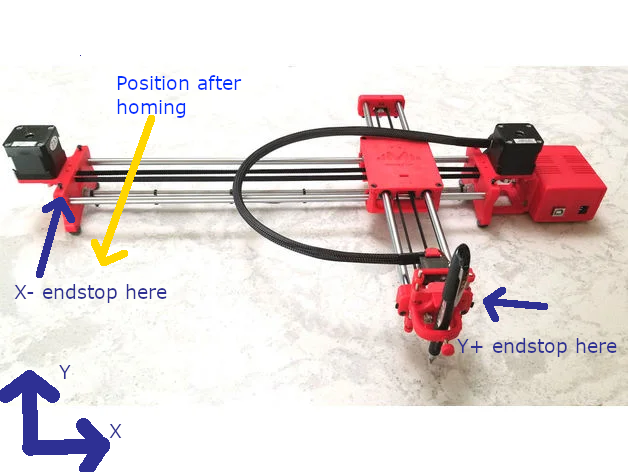

# Klipper + DrawBot

## Related links

[DrawBot on Thingiverse](https://www.thingiverse.com/thing:2349232)

[Klipper firmware](https://www.klipper3d.org/)

[KIAUH - Klipper install helper](https://github.com/th33xitus/kiauh)

## Why to use Klipper instead of GRBL?
1. I had connection problems with GRBL: sometimes commands or 'OK' responses were lost wholly or partially, especially when moving servo frequently. Although my Arduino Uno, servo and steppers had separate power supplies with connected grounds, and baud rate was set to 9600, that issue happened sometimes. Klipper is less demanding on connection quality because it can retransmit lost messages.
2. Klipper can run on a wider range of boards than GRBL, especially on the boards with TMC2209, although such boards may be too expensive for a $100 self-made drawing robot.
3. Because you can.

## Requirements
You need a Linux computer that will act as a Klipper host. Usually Raspberry Pi is used for that purpose.

## Installing Klipper on a host
The most easy way is to install via [KIAUH](https://github.com/th33xitus/kiauh).
First, install Klipper, then Moonraker (HTTP API for Klipper), then fluidd (web interface for klipper that uses Moonraker). 
As a result you should open fluidd interface in a web browser that connects successfully to Moonraker. You will be able to edit `printer.cfg` from a web interface.

Probably later there will be more detailed guide on that topic, but now use Google and read the manual if you encounter any problems.

## Building and flashing firmware
Steps to build firmware if you are using KIAUH:
1. [Advanced]
2. [Build + Flash]
3. Configure:
   ```
   Enable extra low level configuration options
   MCU Architecture: Atmega AVR
   Processor model: atmega328p
   Processor speed: 16 MHz
   Baud rate for serial port: 250000 
   ```
4. Build and flash

## Sample `printer.cfg`

### Description

This sample is intended to be used on Arduino UNO with a CNC Shield V3.
Klipper requires to use microcontroller pin names (like PB3) instead of Arduino ones (like D11).
See [Arduino UNO Pinout](https://www.circuito.io/blog/arduino-uno-pinout/) and [CNC Shield V3 Pinout](https://wiki.keyestudio.com/File:KS0160_%E5%BC%95%E8%84%9A%E5%9B%BE.jpg) for reference.
SG90 servo and NC endstops are used.



**Although I use exactly the same configuraion, this sample is provided as is, without any warranty. I am not responsible for any possible damage. Remember, that incorrect output pin names may cause short-circuit and burn your mcu.**

###
```yaml
[mcu]
# You may need to change this.
serial: /dev/serial/by-id/usb-1a86_USB_Serial-if00-port0
# Has to be the same as in firmware
baud: 250000

[virtual_sdcard]
path: ~/gcode_files

[printer]
kinematics: corexy
# Units: mm/s and mm/s^2, you may try to find values that are the best for your drawbot
max_velocity: 100
max_accel: 1000

[stepper_x]
step_pin: PD2
dir_pin: PD5
enable_pin: !PB0
microsteps: 16
rotation_distance: 32
# endstop_pin is required even if you don't use endstops.
# Add ! after ^ if your use NO endstops instead of NC.
endstop_pin: ^PB1
position_endstop: 0
position_max: 360
homing_speed: 50

[stepper_y]
step_pin: PD3
dir_pin: PD6
enable_pin: !PB0
microsteps: 16
rotation_distance: 32
# endstop_pin is required even if you don't use endstops.
# Add ! after ^ if your use NO endstops instead of NC.
endstop_pin: ^PB2
# No need to set home direction manually: Klipper understands correct direction by seeing that position_endstop = position_max
position_endstop: 220
position_max: 220
homing_speed: 50

# Klipper requires stepper_z to be present
[stepper_z]
step_pin: PD4
dir_pin: PD7
enable_pin: !PB0
microsteps: 16
rotation_distance: 32
# Warning: this is SpnEn on a CNC Shield V3. We must provide some value and we can't use correct PB3 here because Z+ pin has hardware PWM and is used to control a servo. Make sure your don't use PB4.
endstop_pin: ^PB4
position_endstop: 0
position_max: 200
homing_speed: 50

# For the SG90 servo
[servo pen]
pin: PB3
maximum_servo_angle: 180
minimum_pulse_width: 0.001
maximum_pulse_width: 0.002
initial_angle: 0

[gcode_macro PEN_UP]
gcode:
  SET_SERVO SERVO=pen ANGLE=60 

[gcode_macro PEN_DOWN]
gcode:
  SET_SERVO SERVO=pen ANGLE=0

[display_status]

[pause_resume]

# Cancelling drawing works without this macro, but fluidd will complain
[gcode_macro CANCEL_PRINT]
rename_existing: BASE_CANCEL_PRINT
gcode:
  BASE_CANCEL_PRINT

# Uncomment the following lines if you don't have endstops.
# In that case homing will do nothing but reset position to (0, 0)
# [homing_override]
# set_position_x: 0
# set_position_y: 0
# set_position_z: 0
# gcode: 

```

## Troubleshooting
1. Moves are performed in the wrong direction
   
   Use may try to invert dir_pin of stepper_x or stepper_y by prepending `!` before the value.
2. Moves are still performed in the wrong direction. One axis moves correctly, but another one is inverted.

   Reconnect X stepper to Y driver and vice versa.

## Software
I suggest using [LaserWeb4](https://github.com/LaserWeb/LaserWeb4-Binaries/) for gcode generation.

### LaserWeb4 configuration
Machine:
- MACHINE WIDTH: 360mm
- MACHINE HEIGHT: 220mm
- SHOW MACHINE: enabled
- TOOL HEAD -> BEAM: depends on a sharpness of your pen/pencil

GCODE:
- GCODE GENERATOR: Marlin
- START GCODE
  ```
  PEN_UP
  G28 X Y ; Home X and Y
  G21         ; Set units to mm
  G90         ; Absolute positioning
  ```
- END GCODE
  ```
  PEN_DOWN ; don't burden a servo
  ```
- TOOL ON
  ```
  PEN_DOWN
  ```
- TOOL OFF
  ```
  PEN_UP
  ```
- LASER INTENSITY. `=` after `S` is important, otherwise Klipper doesn't understand macro call. Note that S parameter of PEN_DOWN is ignored, but it is impossible to instruct LaserWeb4 not to generate this parameter.
  ```
  S=
  ```
- LASER INTENSITY SEPARATE LINE: disabled